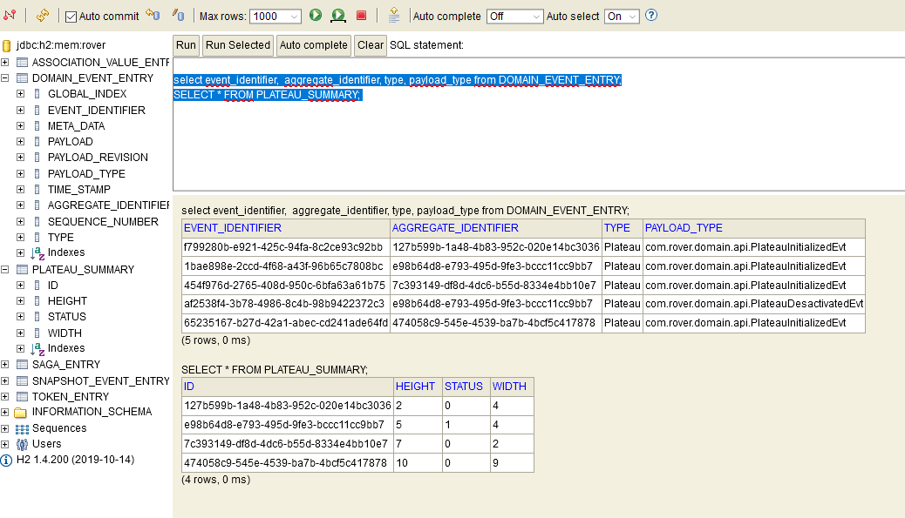
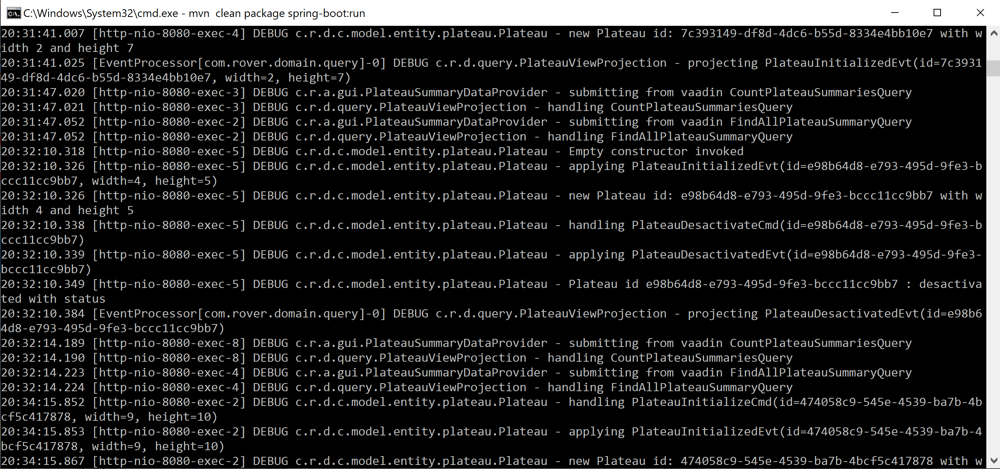

# rover-event-sourcing
This project provides an event-sourcing example of the famous Rover exercise (uses [Axon](https://axoniq.io/) lightweight event-sourcing framework)

1. The `rover-event-sourcing` directory contains a standard Maven project structure:
 	 
   Project build and management configuration is described in the `pom.xml` located in the project root directory.
 	
   Project sources are located under `src/main/java`.
 	
   Project test sources are located under `src/test/java`.

2. Go to the  inner project and type `mvn clean package spring-boot:run`. 

This will build the project, run the Unit Tests and start a Spring Boot application with an embedded Tomcat along with a in-memory H2 database.

Open a browser at [localhost:8080/swagger-ui.html](http://localhost:8080/swagger-ui.html) and initialize one or several Plateaus

Then go to [localhost:8080/h2-console](http://localhost:8080/h2-console), enter the correct database url `jdbc:h2:mem:rover` and login with `sa` and no password.

Verify that you have a row inserted in the table `DOMAIN_EVENT_ENTRY`, as per below.

Notice that per nature `Event Sourcing` persists the state of a business entity as a sequence of state-changing events in an event-store, and thus does NOT need to rely on specific type entity tables to save them, avoiding the need to handle the atomicity of the (save entity + event publishing) operation as described per the pattern [Transactional Outbox](https://microservices.io/patterns/data/transactional-outbox.html).

Actually, `Event sourcing` is one of the best ways to atomically update state and publish an event.

Finally check the logs, and the way the command and event are processed to initialize the plateaus

