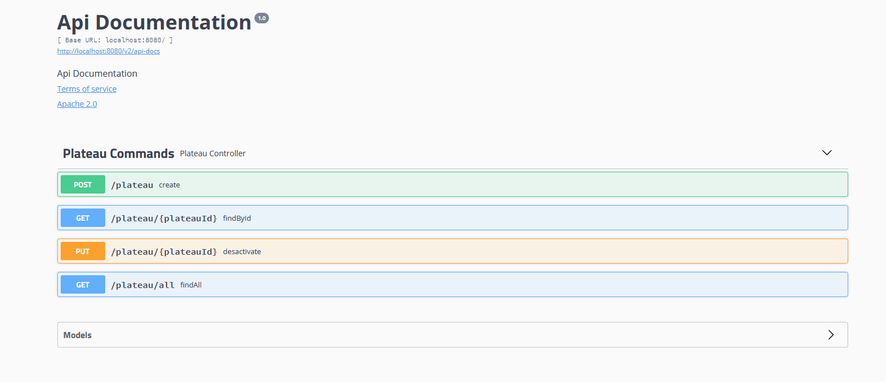

# rover-event-sourcing
This project provides an event-sourcing example of the famous Rover exercise (uses [Axon](https://axoniq.io/) lightweight event-sourcing framework)

1. Clone the .git project 

2. You can run the last version of the project but unless you have already a good understanding of Axon and the subscription queries, it is strongly advised to go step by step and to first checkout the tag `v1.classic-query`

`git clone https://github.com/cyrilondon/rover-event-sourcing.git`


`git checkout tags/v1.classic.query`


3. Go to the  inner project [rover model axon](rover-model-axon/) and type `mvn clean package spring-boot:run`. 

This will build the project, run the Unit Tests and start a Spring Boot application with an embedded Tomcat along with a in-memory H2 database.

Open a browser at [localhost:8080](http://localhost:8080) and create and/or desactivate some plateaus, as per below


Notice that the initial version of the application is not reactive (subscriptions queries are not used yet), and hence you will have to click the refresh button to update the list of Plateau in the summary panel at the bottom of the page.

Then go to [localhost:8080/h2-console](http://localhost:8080/h2-console), enter the correct database url `jdbc:h2:mem:rover` and login with `sa` and no password.

Verify that you have some corresponding rows inserted in the table `DOMAIN_EVENT_ENTRY` (event store), as well as in the table `PLATEAU_SUMMARY` (projection table):


Notice that per nature `Event Sourcing` persists the state of a business entity as a sequence of state-changing events in an event-store, and thus does NOT need to rely on specific type entity tables to save them, avoiding the need to handle the atomicity of the (save entity + event publishing) operation as described per the pattern [Transactional Outbox](https://microservices.io/patterns/data/transactional-outbox.html). Thus the `DOMAIN_EVENT_ENTRY` table represents the C (Command) of CQRS pattern.

From another side, in our case, the table `PLATEAU_SUMMARY` is only used for projection/read purpose and thus stands as the R (Read) of CQRS pattern.

Actually, `Event sourcing` is one of the best ways to atomically update state and publish an event.

You can also use a REST API to use the application. In this purpose, open a browser at [localhost:8080/swagger-ui.html](http://localhost:8080/swagger-ui.html) and initialize one or several Plateaus




Finally check the logs, and the way the command and event are processed to initialize the plateaus


Let us go through the process of creating a Plateau. 

## Command 

When clicking the `Create Plateau` button on the [PlateauGUI](/rover-model-axon/src/main/java/com/rover/application/gui/PlateauGUI.java), we are invoking the 
`plateauCommandService` via `CompletableFuture<UUID> result = plateauCommandService.initializePlateau(cmd);`

```
private Panel createPlateauPanel() {
		TextField width = new TextField("width");
		TextField height = new TextField("height");
		Button submit = new Button("Create Plateau");

		submit.addClickListener(event -> {
			// send the command
			PlateauInitializeCmd cmd = plateauCommandMapper.toPlateauInitializeCmd(Integer.parseInt(width.getValue()),
					Integer.parseInt(height.getValue()));
			CompletableFuture<UUID> result = plateauCommandService.initializePlateau(cmd);

			// show notification to the user
			result.whenComplete((msg, ex) -> {
				// show notification to the user
				if (ex != null) {
					Notification.show(String.format("%s [entity Plateau could not be created]", ex.getMessage()),
							Notification.Type.ERROR_MESSAGE);

				} else {
					Notification.show(String.format("Plateau id [%s] successfully created", msg.toString()),
							Notification.Type.HUMANIZED_MESSAGE);
				}
			});
		});
```

This will have for effect to send the [PlateauInitializeCmd](/rover-model-axon/src/main/java/com/rover/domain/api/command.kt) message via the [CommandPublisher](/rover-model-axon/src/main/java/com/rover/application/out/port/messaging/CommandPublisher.java) delegate (we are coding against interface and not by using Axon implementation in our model as required by Hexagonal Architecture best practices).

```
@Service
public class PlateauCommandServiceImpl implements PlateauCommandService {
	
	private final CommandPublisher commandPublisher;
	
	 public PlateauCommandServiceImpl(CommandPublisher commandPublisher) {
	        this.commandPublisher = commandPublisher;
	    }

	@Override
	public CompletableFuture<UUID> initializePlateau(PlateauInitializeCmd plateauInitializeCmd) {
		  return commandPublisher.send(plateauInitializeCmd);
	}
```

This in turn will be handled by the Aggregate [Plateau](/rover-model-axon/src/main/java/com/rover/domain/command/model/entity/plateau/Plateau.java) via respectively the CommandHandler annotation method, which validates the command and publishes the corresponding `PlateauInitializedEvt`

```
@Service
@CommandHandler
	public Plateau(PlateauInitializeCmd cmd) {
		logger.debug("handling {}", cmd);
		// basic validation
		ArgumentCheck.preNotNull(cmd.getId(), GameExceptionLabels.MISSING_PLATEAU_UUID);
		ArgumentCheck.preNotNull(cmd.getWidth(), GameExceptionLabels.MISSING_PLATEAU_DIMENSIONS);
		ArgumentCheck.preNotNull(cmd.getHeight(), GameExceptionLabels.MISSING_PLATEAU_DIMENSIONS);
		// business validation
		plateauValidator.doValidate(cmd);
		// publishing the event
		apply(new PlateauInitializedEvt(cmd.getId(), cmd.getWidth(), cmd.getHeight()));
	}
```

Once the entity is validated, the `Event` is persisted in the event store and the corresponding `Aggregate` instance is updated accordingly in memory by applying the given event `PlateauInitializedEvt`

```
@EventSourcingHandler
	public void on(PlateauInitializedEvt evt) {
		logger.debug("applying {}", evt);
		// setting the id
		this.plateauId = evt.getId();
		this.dimensions = new TwoDimensions(new TwoDimensionalCoordinates(evt.getWidth(), evt.getHeight()));
		logger.debug("new Plateau id: {} with width {} and height {}", this.plateauId, this.dimensions.getWidth(),
				this.dimensions.getHeight());
		this.status = PlateauStatus.ACTIVE;
		initializeLocations();
	}
```

That's it for the command side of our Plateau business creation. It's now time to have a look at the projection side.

## Projection

`Queries` are, next to `Commands` and `Events`, a fundamental building block of any `CQRS/Event Sourcing` based application (as such, they are supported in Axon Framework by means of a `QueryBus` and `@QueryHandler` methods).

For the projection, we need a `Projected Entity`, some queries against this Entity and finally some way of calling those queries.

The two first elements are both defined in the [query](/rover-model-axon/src/main/java/com/rover/domain/query) package.

The [query.kt](/rover-model-axon/src/main/java/com/rover/domain/query/query.kt) kotlin file defines the projected entity `PlateauSummary` as well as two Hibernate named queries.

```
@Entity
@NamedQueries(
        NamedQuery(name = "PlateauSummary.fetch",
                query = "SELECT c FROM PlateauSummary c WHERE c.id LIKE CONCAT(:idStartsWith, '%') ORDER BY c.id"),
        NamedQuery(name = "PlateauSummary.count",
                query = "SELECT COUNT(c) FROM PlateauSummary c WHERE c.id LIKE CONCAT(:idStartsWith, '%')"))
data class PlateauSummary(@Id var id: String, var width: Int, var height: Int, var status: PlateauStatus) {
    constructor() : this("", 0, 0, PlateauStatus.ACTIVE)
}
```

On the publication of an `PlateauInitializedEvt`, the [PlateauViewProjection](/rover-model-axon/src/main/java/com/rover/domain/query/PlateauViewProjection.java) will react by saving the projected entity on a dedicated repository/table.

```
@EventHandler
	public void on(PlateauInitializedEvt event) {
		logger.debug("projecting {}", event);

		String plateauId = event.getId().toString();
		/*
		 * Update our read model by inserting the new plateau. This is done so that
		 * upcoming regular (non-subscription) queries get correct data.
		 */
		repository.save(new PlateauSummary(plateauId, event.getWidth(), event.getHeight(), PlateauStatus.ACTIVE));
	}
```

The GUI attached [PlateauSummaryDataProvider](/rover-model-axon/src/main/java/com/rover/application/gui/PlateauSummaryDataProvider.java) will then use the named queries to display the desired view of the event store, i.e a summary of all the created plateaus

```
@Override
	protected Stream fetchFromBackEnd(Query vaadinQuery) {
		FindAllPlateauSummaryQuery findAllPlateauSummaryQuery = new FindAllPlateauSummaryQuery(vaadinQuery.getOffset(), vaadinQuery.getLimit(), filter);
		logger.debug("submitting from vaadin {}", findAllPlateauSummaryQuery);
		return queryGateway.query(findAllPlateauSummaryQuery, ResponseTypes.multipleInstancesOf(PlateauSummary.class))
				.join().stream();
	}
```

Those queries will be intercepted by a `@QueryHandler` annotated method, which correspond to the type of the query

```
@QueryHandler
	public List<PlateauSummary> handle(FindAllPlateauSummaryQuery query) {
		logger.debug("handling {}", query);
		TypedQuery<PlateauSummary> jpaQuery = entityManager.createNamedQuery("PlateauSummary.fetch",
				PlateauSummary.class);
		jpaQuery.setParameter("idStartsWith", query.getFilter().getIdStartsWith());
		jpaQuery.setFirstResult(query.getOffset());
		jpaQuery.setMaxResults(query.getLimit());
		return jpaQuery.getResultList();
	}
```
and all our PlateauSummary will be nicely displayed as per below


